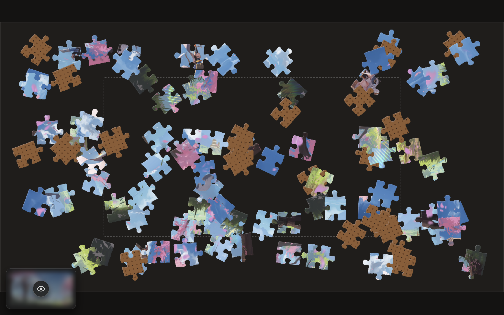

# ヘッドブレイカー

> heddobureikā -> head breaker -> jigsaw puzzle

A silly web-based jigsaw puzzle demo.



Current puzzles:

- `zoe-potter`: [source art here](https://x.com/zoe_IRIAM/status/1933655531409060301)
- `zoe-samurai`: [source art here](https://x.com/zoe_IRIAM/status/1907209022752878958)
- `raora-by-noy`: [source art here](https://x.com/Ururuka_Noy/status/1880853322875421148)

Catalog lives in `puzzles/catalog.toml`. Override it by setting `PUZZLE_CATALOG_PATH` in `.env.local`.

## Dev

Requirements:

- Rust toolchain (cargo)
- `just`
- `trunk` (for frontend dev)
- `wrangler` (for worker dev)
- `worker-build` (`cargo install worker-build`)

Dev tasks live in `justfile` (run `just --list`). Common flow:

- `just dev-vars` (create `.dev.vars`)
- `just web-dev` (run the frontend locally)
- `just worker-dev` (run the worker locally via Miniflare)
- `just room-create` (admin-activate a room)
  - If `.dev.vars` exists, `ADMIN_TOKEN` is loaded from it automatically.
- `just mp-test` (integration test; requires `worker-dev` running and admin token set)
- `just bot-run ROOM_ID --duration-secs 90` (run one heuristic bot client)
- `just recording-status ROOM_ID` (inspect durable command recording state)

Frontend multiplayer config (optional):

- Add `#room=ROOM_ID` to the URL to auto-join a room.
- Canonical dev config: set `TRUNK_PUBLIC_HEDDOBUREIKA_WS_BASE` in `.env` (default in this repo). It must end with `/ws`.

### Bot CLI + command recording

Create a room, then run one or more bot processes (one process = one simulated player):

Note: the bot is not good, like at all, it's slow and move pieces, and that's it.

```bash
cargo run -p heddobureika-cli -- rooms bot run \
  --base-url ws://127.0.0.1:8787/ws \
  --room-id ROOM123 \
  --duration-secs 120

# Optional: retune from a specific NDJSON trace (defaults are already tuned from a recorded run)
cargo run -p heddobureika-cli -- rooms bot run \
  --base-url ws://127.0.0.1:8787/ws \
  --room-id ROOM123 \
  --duration-secs 120 \
  --imitate-from bot-run.ndjson

# Optional: manually simulate network conditions for the bot process
# (inbound/outbound base delay plus extra random jitter)
cargo run -p heddobureika-cli -- rooms bot run \
  --base-url ws://127.0.0.1:8787/ws \
  --room-id ROOM123 \
  --duration-secs 120 \
  --net-in-delay-ms 120 \
  --net-out-delay-ms 80 \
  --net-jitter-ms 40
```

Enable durable per-room command recording:

```bash
cargo run -p heddobureika-cli -- rooms recording enable \
  --base-url ws://127.0.0.1:8787/ws \
  --room-id ROOM123 \
  --admin-token "$ADMIN_TOKEN" \
  --max-events 200000
```

Export NDJSON and compute behavior stats:

```bash
cargo run -p heddobureika-cli -- rooms recording export \
  --base-url ws://127.0.0.1:8787/ws \
  --room-id ROOM123 \
  --admin-token "$ADMIN_TOKEN" \
  --output bot-run.ndjson

cargo run -p heddobureika-cli -- rooms recording summarize --input bot-run.ndjson
cargo run -p heddobureika-cli -- rooms recording compare --baseline human-run.ndjson --candidate bot-run.ndjson
```

Local deploy config (optional):

- Add `.env.local` with `DEPLOY_PUBLIC_URL` and `DEPLOY_RSYNC_DEST` to enable `just deploy`.

## Disclaimer

Made with a lot of help from `codex-cli` (using the `gpt-5.2-codex` model).

## License

For now any file in this repo (except for the puzzle arts) is licensed as [CC BY-NC-SA 4.0](./LICENSE), that may change in the future.
